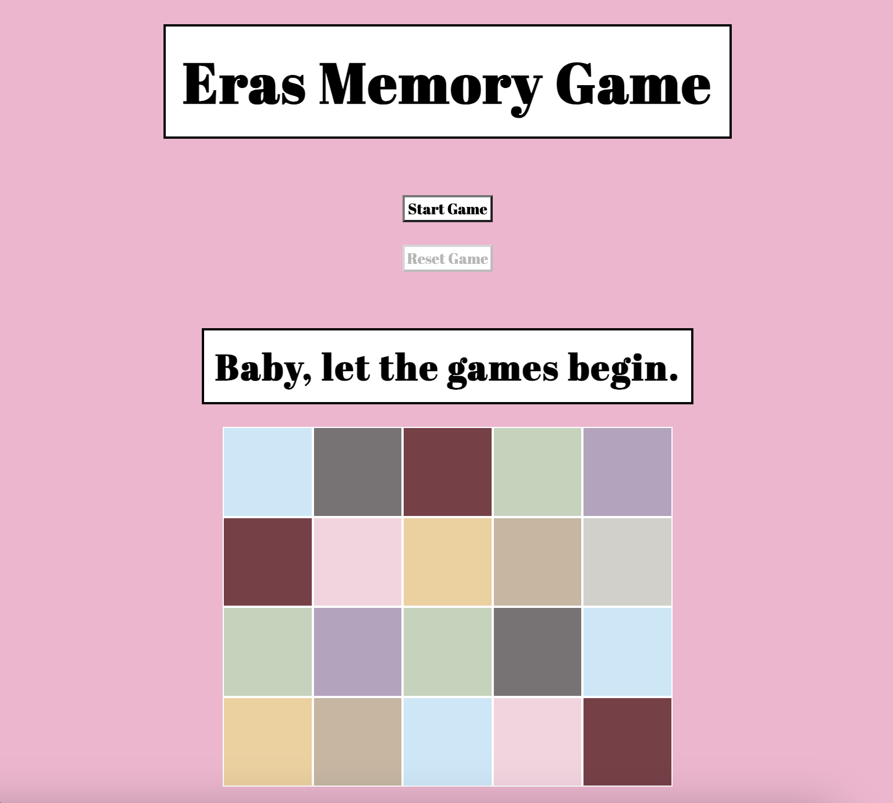
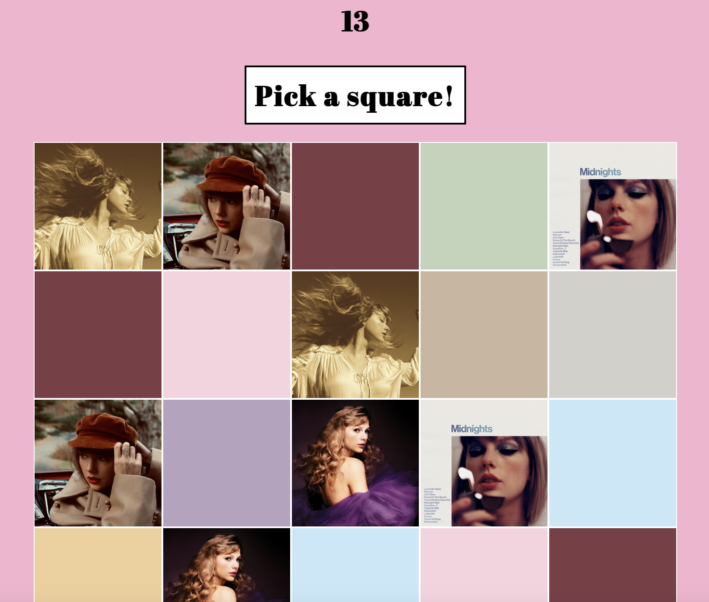
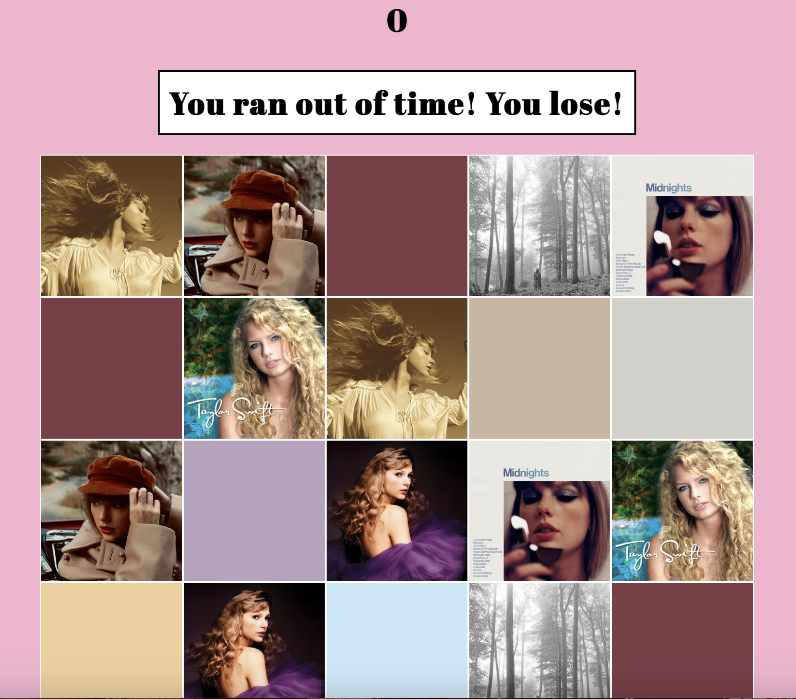
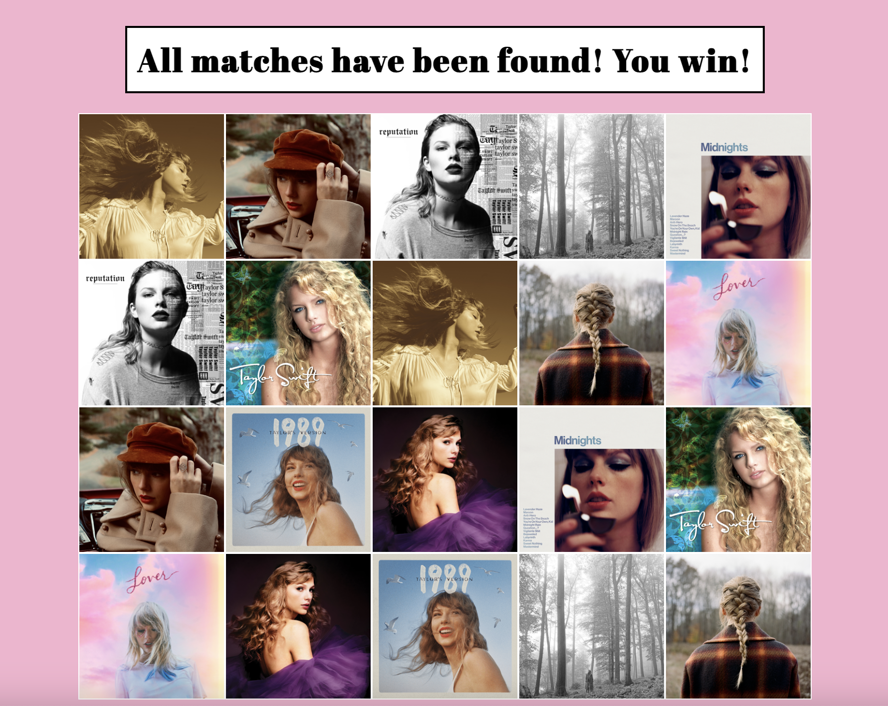

# Eras Memory Game

## Game Description
This is a game of "Memory", a matching game, where the player wins by turning over all matching pairs on the gameboard before the time is up. The player has 60 seconds to uncover all ten of the matching pairs of the gameboard. If two mismatched cards are turned over then the player has to "pick again". However, when two matching cards are turned over, those cards will remain faceup on the gameboard. Once all matches are found before time runs out, the game is won. If the player loses, then they can reset the game to start over.

The design of the game is inspired by Taylor Swift's "The Eras Tour". This is a concert tour where the artist performs music from her 10 albums, or "musical eras". The matching cards in this game represent each of the artist's 10 album covers, and albums that have been re-recorded have been replaced with album cover art from the "Taylor's Version" albums.

## Game Screenshots
This is the game in its initial state:

The game displays a countdown for time remaining and messages for when to "pick a square" or "try again":

The matches were not all found before time is up and the game is lost:

All matches are found and the game has been won:

## Technologies Used
Javascript was used to create the logic of the game and track the game state. Functions were written in order to kickoff the game, keep track of time remaining, and to store the initial state of the game. Additional functions enable player moves, evaluate the gameboard, and render messages.

HTML was used to organize the content of the webpage. This included the game title, buttons to start and reset the game, the countdown display, display messages that indicated the state of the game, and to store the layout of the gameboard grid.

CSS was used to style the game and reflect an "Eras" theme by using colors and font similar to that of a Taylor Swift "The Eras Tour" poster.

## Getting Started

## Next Steps
Planned future enhancements include adding the ability for the player to shuffle the gameboard and to select how much time they would like to solve the game. Other enhacements might include the ability to switch the theme of the game based on a set of different options that store different artwork.
